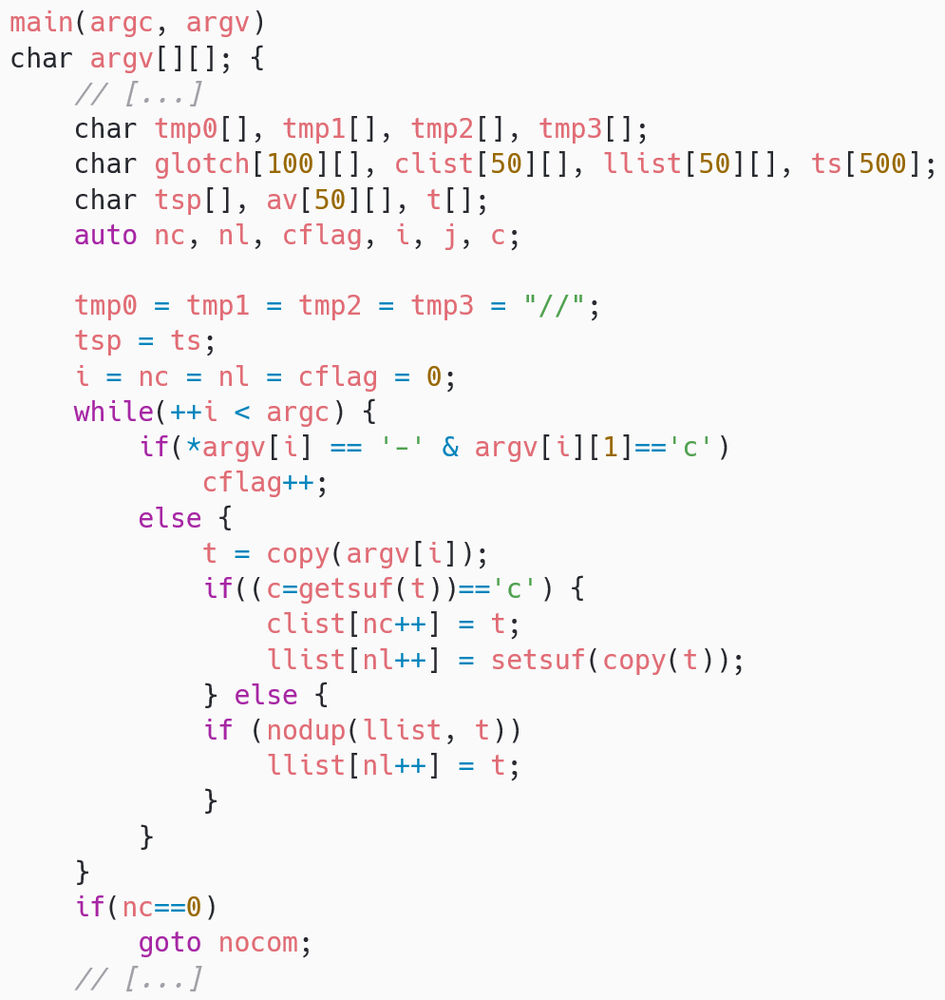

# Vocabulaire et jargons

Démystifier les principaux concepts du Craft

---

# Introduction

* Julien
  * DevOps
  * Python
  * passions : informatique et Craft
  * talker
  * bénévole aujourd'hui
* tutoiement, interventions et échanges

---

## Le sujet

> Chaque métier a son jargon, chaque spécialité en rajoute. Cela rend la communication efficace, une fois qu'on maitrise tous ces termes.  
> 
> Ensemble, faisons une passe sur le vocabulaire lié au Craft, en toute simplicité, pour découvrir ces termes parfois inconnus, parfois déjà connus sous un autre nom.

---

## Les attendus ?

Quels sont les termes à définir ?

---

# Comment définir ?

* c'est compliqué  <!-- .element: class="fragment" -->

* > 1. Fait de déterminer les caractéristiques d'un concept, d'un mot, d'un objet, etc., ensemble des propriétés essentielles de quelque chose.  
  > Exemple : "La définition de ce mot n'est pas facile."  
  > — Larousse
<!-- .element: class="fragment" -->

* > 1. Opération par laquelle on détermine le contenu d'un concept en énumérant ses caractères.  
  > — Le Robert
<!-- .element: class="fragment" -->

* Jeu : quelles différences ?  <!-- .element: class="fragment" -->

Note:

* "concept" seulement ou aussi "mot", "objet", "quelque chose", ...
* "caractéristiques" versus "ensemble des propriétés essentielles de quelque chose"
* "exemple" ou pas ?
* "fait" versus "opération"
* "opération" versus "fait"
* une courte et l'autre moins
* blague : y'en a une faut accepter les cookies pour pouvoir la lire, et pas l'autre

---

## Define Define

[TodePond - Define Define](https://www.youtube.com/watch?v=ZMklf0vUl18)  <!-- .element: class="fragment" -->

  <!-- .element: class="fragment" width="200px" -->

> A definition is a tool that we use to express ourselves, and to communicate. Sometimes, the definition is for other people. Sometimes it's just for you.  
> The definition that **you** use tell us something about **you**.  
> Personally, I love to use definitions very loosely. But what about you ? What definitions do you use ?  
<!-- .element: class="fragment" -->

> Une définition est un outil que l'on utilise pour s'exprimer, et pour communiquer. Des fois, la définition est pour les autres personnes. Des fois, juste pour soi.
> La définition que **tu** utilises nous dis quelque chose de **toi**.
> Personnellement, j'aime utiliser les définitions de façon très approximative. Et toi ? Quelles définitions tu utilises ?
<!-- .element: class="fragment" -->

Note:

HTML n'est pas un langage de programmation mais de balisage, est-ce que ça veut dire qu'on ne programme pas en l'utilisant ? ça dépend ...
Est-ce que la question précédente est stupide ? oui, plutôt

je ne dirais pas "j'aime", mais je suis plutôt d'accord avec ça, et malgré moi je le fais

---

## Méthode

* exercice ensemble
* je suis préparé
* pas de conviction
* objectif : se familiariser avec ces termes

Note:

Faisons l'exercice ensemble d'essayer de définir des termes.
Je viens préparé : j'ai de slides, j'ai répété, je sais où je vous emmène, ...
Mais faisons l'exercice ensemble d'essayer de définir des termes.
Mon but n'est pas du tout de vous convaincre que j'ai raison.
Mon but est que dans une heure on soit + familier de ces termes, vous et moi.
Ok ? c'est parti !

---

# n°1

  <!-- .element: width="1500px" -->

Note:

oui désolé c'est du Python, je vous avais dis que j'atais fan de Python
j'espère que ça ne vous empêche pas de le lire

qu'est-ce que vous en pensez ?
* uv tool run ruff check --select 'ALL' src/code_review.py<br/>
	- accents dans le nom
	- pas de docstring
	- pas de timeout
	- print au lieu de logging
	- pas de typage
* autres :
	- nom en français
	- pas de paramètres
	- FTP et non pas FTPS
	- FTP et requête HTTP, wtf ?
	- gestion des exceptions (réseau, json parsing)
	- url hardcodée
	- pas de check du HTTP status code de la réponse

---

Quel terme j'essaye de vous faire deviner ?

---

## Code Review

Quelle définition vous proposeriez ?

> Code Review : examen minutieux du code produit par une personne, afin d'en déceler des erreurs potentielles ou factuelles, pour faire des retours constructifs, pouvant mener à des discussions, afin d'améliorer la qualité, de partager des pratiques, d'apprendre et de construire une culture d'équipe
<!-- .element: class="fragment" -->

Notes:

ici je vous ai forcé à plisser des yeux pour trouver tous les défauts, je vous ai fait creuser votre cervelle
j'essaye de faire de même quand quelqu'un me propose de relire une PR
j'espère qu'on fait de même pour celles que je propose
le retour peut éventuellement se faire à l'oral, de façon synchrone, ou bien la relecture peut être guidée, ... trouvez ce qui vous plait

---

# n°2

```python
grid_size_in_meters = 200
length_of_degree_of_arc_in_france_in_kilometers = 111.358
step = grid_size_in_meters / length_of_degree_of_arc_in_france_in_kilometers
```
<!-- .element: class="fragment" -->

Où est le bug ?
<!-- .element: class="fragment" -->

Quelle est la cause ?
<!-- .element: class="fragment" -->

Notes:

véritable exemple du code que j'ai écris et qu'il a fallu que je débug
hint : ma step est beaucoup trop petite (symptôme)

erreur d'unité
par quoi elle est causée ?

mélange des unités
est-ce qu'on aurait pu s'en douter ?

---

Quel terme j'essaye de vous faire deviner ?

---

## Code smell

> Code smell : quelque chose qui en soit n'est peut-être pas une erreur, mais risque d'en causer plus tard.
<!-- .element: class="fragment" -->

  <!-- .element: class="fragment" width="300px" -->

  <!-- .element: class="fragment" width="300px" -->

Vous avez des exemples ?
<!-- .element: class="fragment" -->

Clean code !
<!-- .element: class="fragment" -->

Notes:

il y en a plein d'autres :
* une variable/fonction/classe/... mal nommée
* avoir des fonctions hyper longues et/ou trop complexes (if imbriqués, récursivité, ...)
* beaucoup de code dupliqué
* code mort (jamais appellé)
* trop de paramètres
* ...

---

# n°3

  <!-- .element: width="1900px" -->

Est-ce que ma fonction est correcte ?
<!-- .element: class="fragment" -->

Comment en être sûr ?
<!-- .element: class="fragment" -->

---

Quel terme j'essaye de vous faire deviner ?

---

## Test

Quelle définition vous proposeriez ?

> Test : contexte + action = résultat attendu ?  
> Autrement dit : s'assurer du fonctionnement du code tel que spécifié.  
> Pas forcément automatiquement, peut-être manuellement ou hybride.
<!-- .element: class="fragment" -->

Comment tester la fonction précédente ?
<!-- .element: class="fragment" -->

Comment on testerait récupérer_le_bundle ? On en discute ce midi !
<!-- .element: class="fragment" -->

---

# n°4

  <!-- .element: width="1200px" -->

Est-ce que vous préférez ce code ?
<!-- .element: class="fragment" -->

Est-ce qu'il fait fondamentalement la même chose ou pas ?
<!-- .element: class="fragment" -->

Qu'est-ce que j'ai fait pour le changer ?
<!-- .element: class="fragment" -->

---

Quel terme j'essaye de vous faire deviner ?

---

## Refactoring

> Refactoring (version stricte): changer le fonctionnement/la structure interne, sans impacter le fonctionnement externe.
> Pour améliorer des propriétés liées à la qualité : lisibilité, évolutivité, ...
> Allant du simple renommage d'une variable locale, jusqu'à changer complètement toute l'architecture.

⚠️ Définition variable !
<!-- .element: class="fragment" -->

Notes:

cette définition est souvent utilisée de façon très approximative, même par moi : des fois le comportement est altéré, mais on juge que c'est négligeable
ici, je ne raise plus d'exception, fondamentalement j'ai changé le comportement de la fonction, mais c'est pour le mieux (peut-être)
d'autres personnes préfèrent une définition très stricte : si on peut voir la moindre différence de l'extérieur, alors c'est peut-être plutôt un fix, c'est le débat du fond versus la forme

---

# n°5

Qui aurait préféré des questions individuelles plutôt que collectives ?

Pourquoi préférer le faire collectivement ?
<!-- .element: class="fragment" -->

Notes:

réponses anticipées :
* le stress,
* les erreurs,
* la diversité des réponses,
* les échanges qui en découlent,
* l'inutilité de le faire chacun de son côté,
* ...

---

Quel terme j'essaye de vous faire deviner ?

---

## Pair programming

> Pair Programming (version stricte) : il y a un "conducteur" (driver) qui a le clavier et la souris, et un "navigateur/observateur" qui dicte comment coder au conducteur.
> Les rôles sont échangés à intervalles réguliers.

⚠️ Définition variable !
<!-- .element: class="fragment" -->

Quels bénéfices ?
<!-- .element: class="fragment" -->

Mais là vous n'êtes pas que 2 ...
<!-- .element: class="fragment" -->

Notes:

ça ressemble vraiment à "quelqu'un qui réfléchit" versus "quelqu'un qui tape du code",
et c'est pas si faux, mais en fait ça revient surtout à couper en 2 la pratique du code :
le côté très mécanique ("taper au clavier, corriger les typos, relancer les tests, scroller, naviguer dans l'IDE/la doc/StackOverflow/...")
et l'autre qui, déchargé de cela, a l'esprit un peu plus libre pour réfléchir de façon stratégique : où est-ce qu'on va, comment y aller, qu'est-ce qu'on oublie, ...

C'est la version "stricte", mais à titre personnel je l'utilise de façon plus flexible :
du moment qu'on est deux pour un seul IDE-clavier-souris, je considère qu'on paire, même si on n'a pas forcément de rôles et qu'on ne les alterne pas.
C'est peut-être moins efficace, mais très naturel

Et c'est une définition très structurelle, en parlant juste des rôles, mais ça a aussi des effets autres que simplement produire du code :
* produire du meilleur code
* aller plus vite parfois
* partager les connaissances et pratiques
* renforcer la confiance en soi
* construire du lien humain
* toujours quelqu'un de dispo pour débloquer (car toujours quelqu'un)
* ...

Et encore une fois, c'est une vision stricte : ça ne parle que de programming, quid du debugging ? du design ? des campagnes de test manuel ? des slides pour la démo ? ...
"programming" peut être entendu au sens très très large pour moi, c'est grosso modo toutes les activités dans la vie des devs
j'ai déjà fait du pair-"création de réunion Teams" ou du pair-"imputation des feuilles de temps".

---

Quel terme j'essaye de vous faire deviner ?

---

## Mob programming

Quelle définition vous proposeriez ?

> Mob Programming : du pair programming, mais pas en paire, en trio, quatuor, quintette, sextuor, septuor, 8, 9, 10 ou plus ... peu importe le nombre
<!-- .element: class="fragment" -->

En cours de renommage :
<!-- .element: class="fragment" -->

> Software teaming : toute l'équipe (les devs bien sûr, mais aussi PO, UX, test, archi, cyber, ...) réunie ensemble pour produire du logiciel.
> Toutes les personnes requises sont présentes simultanément, pour travailler toutes ensemble sans blocage.
<!-- .element: class="fragment" -->

Notes:

soit en version stricte : toujours un seul conducteur, plusieurs navigateurs, et on tourne
soit en version souple : plein de monde pour un seul écran

mêmes avantages, globalisés

y'a des équipes qui travaillent comme ça quasi tout le temps

---

# n°6 : TDD

Le terme c'est : TDD.

Mais je dois d'abord vous parler de RGR.
<!-- .element: class="fragment" -->

---

## Le Red/Green/Refactor du TDD

  <!-- .element: width="1400px" -->

---

Définition :
* une technique "red/green/refactor"  <!-- .element: class="fragment" -->
* une façon de faire des "petits pas"  <!-- .element: class="fragment" -->
* une façon de toujours savoir exactement ce qui marche ou pas  <!-- .element: class="fragment" -->
* une façon de produire une "doc" de comment utiliser le code  <!-- .element: class="fragment" -->
* une façon d'avoir du code testable  <!-- .element: class="fragment" -->
* une façon d'avoir du feedback rapide  <!-- .element: class="fragment" -->
* une façon d'être certain d'avoir des tests à la fin  <!-- .element: class="fragment" -->
* une technique de design ("test-driven design" ?)  <!-- .element: class="fragment" -->
* n'est PAS la solution ultime à tous les problèmes  <!-- .element: class="fragment" -->

Mise en pratique tout-à-l'heure !  <!-- .element: class="fragment" -->

---

# n°7

  <!-- .element: width="1200px" -->

Qu'est-ce que vous en pensez ?

Notes:

complexe / bien conçu

permet de faire fonctionner les 2 ensemble

---

Quel terme j'essaye de vous faire deviner ?

---

## Design patterns

> Design Pattern : un pattern ("motif") d'une même solution pour un même problème.

chat = "animal quadrupède à fourrure, qui fait miaou!"
<!-- .element: class="fragment" -->

catalogue de problèmes/solutions connus
<!-- .element: class="fragment" -->

  <!-- .element: class="fragment" width="100px" -->

Notes:

les connaitre permet de rapidement trouver une solution classique à des problèmes connus (par exemple Memento)
très historiques, très liés à la POO

lesquels vous connaissez ? Visitor, Singleton, Iterator, Strategy, Abstract Factory (le fameux !), Builer, Memento, Composite, Decorator, Proxy, Observer, ...

---

# n°8

Dites "panier piano" 10 fois rapidement !
<!-- .element: class="fragment" -->

Qui l'a fait le + vite correctement ?
<!-- .element: class="fragment" -->

Qui le ferait encore mieux ?
<!-- .element: class="fragment" -->

  <!-- .element: class="fragment" width="900px" -->

---

Quel terme j'essaye de vous faire deviner ?

---

## CI/CD

> Continuous Integration (CI) : "intégration en continu", les changements de code sont pris en compte incrémentalement, et l'application est reconstruite/retestée/re... à chaque fois
<!-- .element: class="fragment" -->

Pas de notion de branche git ...
<!-- .element: class="fragment" -->

Trunk versus feature branches
<!-- .element: class="fragment" -->

> Continuous Delivery (CD) : livraison en continu, les changements sont livrés, prêts à être utilisés.
<!-- .element: class="fragment" -->

> Continuous Deployment (CD) : déploiement en continu, les changements sont automatiquement déployés et utilisés.
<!-- .element: class="fragment" -->

Ensemble d'outils et leurs pratiques associées
<!-- .element: class="fragment" -->

Notes:

(ok, là c'était peut-être difficile à deviner à partir de l'indice, mais j'espère qu'on aura bien rigolé)
que veut dire CI ?
que veut dire CD ?
que veut dire CI/CD ?

2 sens du mot CI (features branches versus tronc commun pour intégration fréquente)
2 mots CD (delivery/deployment)

---

# n°9


Qu'est-ce que c'est ?

Comment il en sont arrivés à ce niveau d'efficacité ?
<!-- .element: class="fragment" -->

Comment combiner rapidité et fiabilité ?
<!-- .element: class="fragment" -->

---

Quel terme j'essaye de vous faire deviner ?

---

# DevOps

> DevOps : ensemble de pratiques, outils, et changements culturels pour accorder la production de code avec son exécution en prod.

  <!-- .element: class="fragment" width="500px" -->

Dérive corporate :
<!-- .element: class="fragment" -->

> DevOps : non pas une culture d'avoir un objectif commun, mais juste le rôle des gens qui servent de tampon entre les Dev et les Ops, ou bien qui font le boulot des deux.
<!-- .element: class="fragment" -->

Shift Left et Dev____Ops
<!-- .element: class="fragment" -->

Notes:

faire communiquer les gens, aligner les incentives (vitesse versus fiabilité)

Et ça peut se décliner à toutes les sauces ! Qu'est-ce qu'il manque sur ton projet ? De la sécurité ? Bim du DevSecOps !

Mini-jeu : lesquels sont vrais, lesquels sont inventés ?
* DevOps
* DevSecOps
* DataOps
* MLOps
* AIOps
* GitOps
* FinOps
* ~~CyclOps~~
* ~~E-ScalOps~~

Souvent du marketing néanmoins

---

# n°10

Sortez vos mains, on va faire un atelier !

Faites-le 5 fois d'affilée.
<!-- .element: class="fragment" -->

Qui pense maîtriser ?
<!-- .element: class="fragment" -->

Notes:

si y'en a qui sont fortiches, s'entraîner à faire les lunettes de super-héros (attention, ça tire sur les avant-bras !)

---

Quel terme j'essaye de vous faire deviner ?

---

## Kata / Dojo

> Kata : dans les arts martiaux japonais, suite codée de mouvements constituant un exercice d'entraînement à la pureté du geste.  
> — Le Robert

> Dojo : salle où l'on pratique les arts martiaux.  
> — Le Robert
<!-- .element: class="fragment" -->

> Le _dōjō_ est le lieu où l'on étudie/cherche la voie.  
> [...]  
> Le dojo est un lieu où l'on progresse. Cette progression est obligatoirement supervisée et contrôlée par un maître.  
> — Wikipedia
<!-- .element: class="fragment" -->

> Practice makes perfect.
<!-- .element: class="fragment" -->

Notes:

Dans le Craft, on a repris ce concept : le dojo est un endroit où l'on pratique des kata, de petits exercices, qu'on peut répéter, pour perfectionner sa maîtrise d'une technique.

---

# n°11

Question pour un (groupe) champion !

Top !  <!-- .element: class="fragment" -->

* je suis un concept de programmation  <!-- .element: class="fragment" -->
* je suis issu de l'orienté-objet  <!-- .element: class="fragment" -->
* je promets du code maintenable, testable, flexible, fiable, découplé, ...  <!-- .element: class="fragment" -->
* je suis composé de 5 lettres  <!-- .element: class="fragment" -->
* je suis un acronyme  <!-- .element: class="fragment" -->
* je suis synonyme de robuste  <!-- .element: class="fragment" -->
* je suis ...  <!-- .element: class="fragment" -->
* je suis ...  <!-- .element: class="fragment" -->

SOLID !  <!-- .element: class="fragment" -->

---

## SOLID

* SRP : Single Responsibility Principle  <!-- .element: class="fragment" -->
	* une classe ne doit faire qu'une seule chose, et le faire bien (pour qu'elle n'ait qu'une seule raison de changer)  <!-- .element: class="fragment" -->
* OCP : Open-Closed Principle  <!-- .element: class="fragment" -->
	* une classe est ouverte aux extensions, mais fermées aux modifications  <!-- .element: class="fragment" -->
* LSP : Liskov Substitution Principle  <!-- .element: class="fragment" -->
	* si une méthode prend en paramètre (ou renvoie) un Animal, alors ça peut concrètement être un Cat ou un Dog car ce sont des Animal  <!-- .element: class="fragment" -->
* ISP : Interface Segregation Principle  <!-- .element: class="fragment" -->
	* une interface ne doit contenir que ce qu'il faut pour ses clients  <!-- .element: class="fragment" -->
* DIP : Dependency Inversion Principle  <!-- .element: class="fragment" -->
	* le code doit dépendre de classes abstraites (qui lui sont fournies) et non pas de classes concrètes (qu'il instancie)  <!-- .element: class="fragment" -->

Notes:

c'est très lié à l'orienté-objet, si vous codez avec un autre paradigme (fonctionnel typiquement) ça ne sera pas pertinent
c'est pratique pour les code reviews (code smells) afin de partager un vocabulaire commun

---

# n°12

Petite anecdote de complexité de cache ...

---

Quel terme j'essaye de vous faire deviner ?

---

## KISS

> KISS : keep it simple stupid !

> Conserve la simplicité idiote !
<!-- .element: class="fragment" -->

C'est compliqué !
<!-- .element: class="fragment" -->

> Je n’ai fait \[cette lettre] plus longue que parce que je n’ai pas eu le loisir de la faire plus courte.  
> — Blaise Pascal
<!-- .element: class="fragment" -->

> YAGNI : You ain't gonna need it
<!-- .element: class="fragment" -->

> T'en auras pas b'soin
<!-- .element: class="fragment" -->

Notes:

Origine : comment concevoir un avion de chasse qui soit réparable par un mécano moyen, avec des outils communs, en situation de stress ?

sans faire un cours sur la complexité et l'entropie (en plein boom de l'IA), c'est compliqué de faire simple, mais c'est important

Un mantra pour se forcer à ne pas inclure des choses "au cas où", partons du principe qu'il n'y en aura pas besoin, et on les rajoutera quand il le faudra

---

# n°13

  <!-- .element: width="800px" -->

Que pensez-vous de ce code ?

Notes:

produit en 1972, soit 7 ans avant même la naissance du plus vieux des 3 créateurs de GitHub

---

Quel terme j'essaye de vous faire deviner ?

---

## Code legacy

Impossible de proposer une définition !

* ou bien du code écrit il y a très longtemps (à jour ou pas)  <!-- .element: class="fragment" -->
* ou bien du code plutôt récent, mais qui a beaucoup de dépendances qui ne sont pas à jour  <!-- .element: class="fragment" -->
* ou bien du code écrit par d'autres personnes (peu importe quand), qu'on a récupéré mais qu'on aurait pas écrit comme ça  <!-- .element: class="fragment" -->
* ou bien du code écrit par soi, mais on ne l'écrirait plus pareil maintenant  <!-- .element: class="fragment" -->
* ou bien du code sans doc  <!-- .element: class="fragment" -->
* ou bien du code sans test  <!-- .element: class="fragment" -->
* ou bien du code tellement mal conçu (dette technique) qu'on n'arrive rien à faire sans causer des régressions  <!-- .element: class="fragment" -->
* ou bien un système qu'on ne comprend pas car peu clair  <!-- .element: class="fragment" -->
* ou bien un système qu'on essaye de remplacer (rewrite)  <!-- .element: class="fragment" -->
* ou bien tout à la fois  <!-- .element: class="fragment" -->

Jamais un compliment, surtout synonyme de problèmes.
<!-- .element: class="fragment" -->

---

# n°14

  <!-- .element: width="1200px" -->

C'est quoi cette fonction ? (si vous ne la connaissez pas déjà)

Que fait la lib Python "ftfy" ?
<!-- .element: class="fragment" -->

Que fait la lib Python "PyERFA" ?
<!-- .element: class="fragment" -->

Notes:

originellement, elle s'appelle "InvSqrt" et a des commentaires

"fixes text for you" : répare le mojibake

ERFA est une lib de fonctions astronomiques, dont PyERFA est un ensemble de bindings Python pour Numpy, sans passer par Astropy

avant de devoir écrire ces lignes, je n'avais jamais entendu parler de ces 2 librairies, et pourtant je semble être un expert lorsque j'en parle

---

Quel terme j'essaye de vous faire deviner ?

---

## Documentation

Très difficile à définir (même pour un dico !)

Produire des documents pour expliquer quelque chose :  <!-- .element: class="fragment" -->

* quel type de document ?  <!-- .element: class="fragment" -->
* à quel but ?  <!-- .element: class="fragment" -->
* pour quoi ?  <!-- .element: class="fragment" -->
* comment ?  <!-- .element: class="fragment" -->
* quand ?  <!-- .element: class="fragment" -->
* stocké où ?  <!-- .element: class="fragment" -->
* ...  <!-- .element: class="fragment" -->

Philosophie (Diátaxis) et outillage
<!-- .element: class="fragment" -->

  <!-- .element: class="fragment" width="700px" -->

Notes:

Markdown, Asciidoc, wiki, ReST, Javadoc, Doxygen, ...
Schémas Excalidraw, Draw.io, photos du tableau, ...

---

# n°15 : Architecture

> Architecture : choisir quelles portes on veut s'ouvrir, lesquelles on va se fermer, et les coûts/bénéfices associés.

  <!-- .element: class="fragment" width="1000px" -->

---

Architectures :

* Héxagonale / Clean / Onion  <!-- .element: class="fragment" -->
* en couche  <!-- .element: class="fragment" -->
* Orientée-services  <!-- .element: class="fragment" -->
* Micro-services  <!-- .element: class="fragment" -->
* CQRS-ES  <!-- .element: class="fragment" -->
* ...  <!-- .element: class="fragment" -->

---

# n°16 : DDD

> DDD: Domain-driven design, mettre le "métier" au centre des discussions, du code, des pratiques.

Un sujet très large.

Notes:

Ubiquitus language

patterns stratégiques et tactiques

---

# Récapitulatif

- Code review
- code smell
- tests
- refactoring
- pair/mob programming/software teaming
- TDD
- Design patterns
- CI/CD
- Dev(Sec)Ops
- dojo + kata
- SOLID
- KISS / YAGNI
- Legacy
- Documentation
- Archi héxa/clean/couches/orientée-services/micro-services/cqrs-es
- DDD
